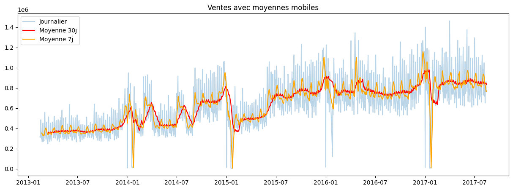
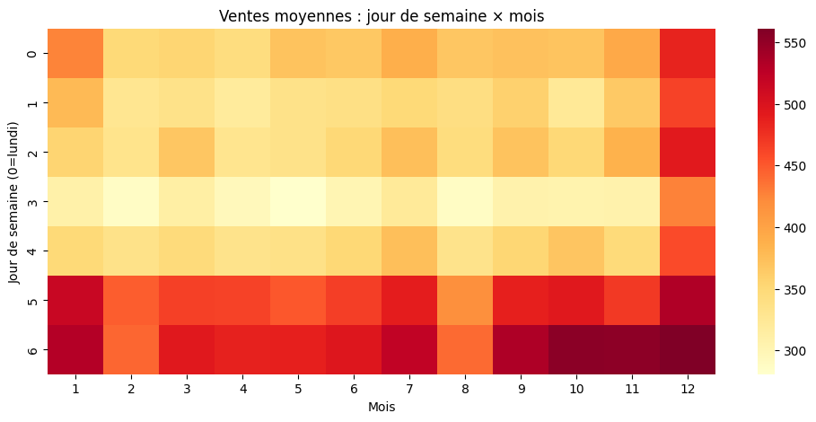
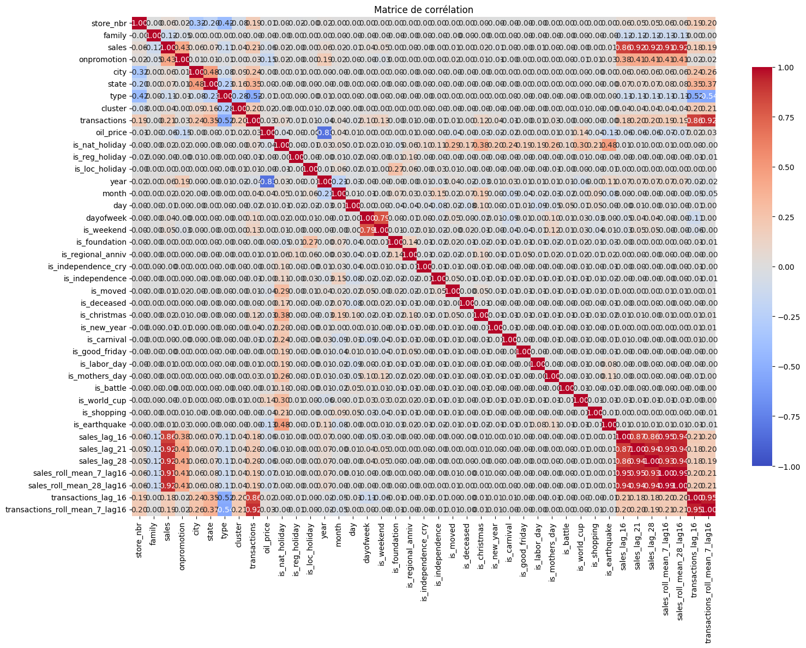
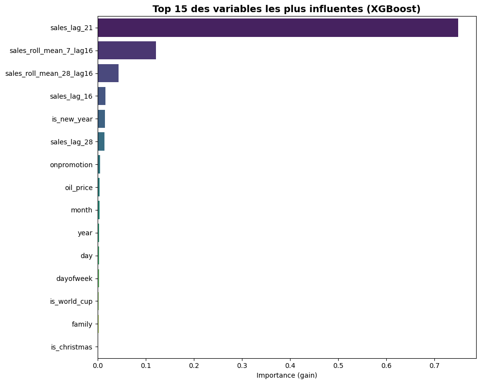
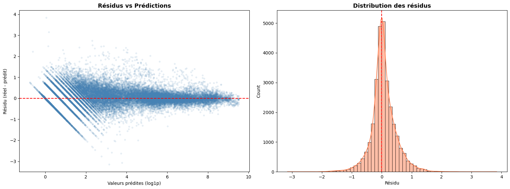
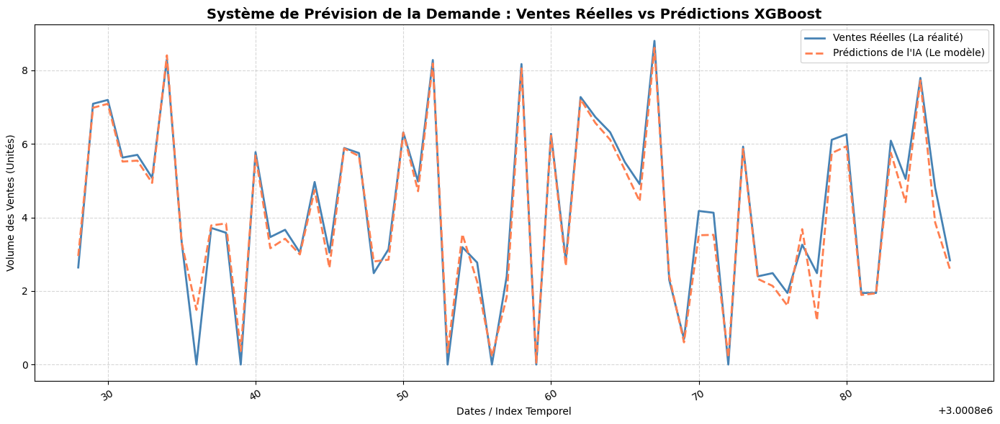

 # Store Sales Forecasting System

A time-series machine learning project for forecasting daily product sales across stores. The project uses historical sales, store information, transactions, oil prices, holidays, and calendar features to train an XGBoost regression model.

## Project Overview

The objective is to estimate future sales for each store and product family. The workflow includes:

1. Loading and inspecting the raw datasets.
2. Merging sales with store, transaction, oil, and holiday information.
3. Creating calendar, holiday, lag, and rolling-average features.
4. Exploring sales trends and seasonal patterns.
5. Training an XGBoost regression model.
6. Evaluating predictions on a chronological holdout period.
7. Forecasting future sales and creating a submission file.

## Repository Structure

```text
|-- notebooks/
|   `-- sales-forecasting-system.ipynb
|-- assets/
|   |-- sales_trend.png
|   |-- seasonal_heatmap.png
|   |-- correlation_matrix.png
|   |-- predictions_vs_actual.png
|   |-- feature_importance.png
|   |-- residual_analysis.png
|   `-- future_forecast.png
`-- README.md
```

## Dataset Description

| Dataset | Description |
|---|---|
| `train.csv` | Historical sales observations used for training and evaluation. |
| `test.csv` | Future observations for which sales must be predicted. |
| `stores.csv` | Store location, type, and cluster information. |
| `transactions.csv` | Daily transaction counts for each store. |
| `oil.csv` | Daily oil prices. |
| `holidays_events.csv` | National, regional, and local holidays and events. |

## Feature Engineering

The model uses several groups of features:

- **Calendar features:** year, month, day, day of the week, and weekend indicator.
- **Store features:** store number, city, state, store type, and cluster.
- **Holiday features:** national, regional, local, and event-category indicators.
- **Historical demand features:** sales lags of 16, 21, and 28 days.
- **Rolling features:** seven-day and twenty-eight-day averages based on lagged sales.
- **Transaction features:** lagged transactions and their rolling average.

The target is transformed with `log1p` before training to reduce the impact of very large sales values.

## Exploratory Analysis

The notebook investigates the main patterns in the data, including overall sales trends, weekly seasonality, monthly seasonality, product-family performance, store performance, state-level sales, holiday effects, and the impact of the 2016 earthquake.

### Overall Sales Trend




### Seasonal Patterns




### Correlation Analysis




## Model

The project uses `XGBRegressor` with:

- 5,000 maximum estimators;
- a learning rate of `0.03`;
- early stopping based on the validation period;
- RMSE as the evaluation metric;
- categorical feature support enabled.

The data is split chronologically into training, validation, and evaluation periods. This preserves the time order and avoids using future observations to predict the past.

## Results


| Metric | Value |
|---|---:|
| Mean Absolute Error | 0.29 |
| Root Mean Squared Error | 0.43 |

### Actual Versus Predicted Sales

Add the evaluation chart here:


### Feature Importance

Add the feature importance chart here:



### Residual Analysis

Add the residual analysis chart here:



## Future Forecast

The trained model is applied to the test observations. Predictions are converted back to the original sales scale with `expm1`, clipped at zero, and aggregated by date for visualization.

Add the future forecast chart here:



## How to Run the Project

1. Clone or download the repository.
2. Install the required Python packages:

   ```bash
   pip install pandas numpy matplotlib seaborn scikit-learn xgboost jupyter nbformat
   ```

3. Open the notebook:

   ```bash
   jupyter notebook notebooks/sales-forecasting-system.ipynb
   ```

4. Update the dataset paths in the loading cell if necessary. The notebook currently contains Kaggle paths, while this repository stores the files in the local `data/` directory.
5. Run the notebook from top to bottom.

## Generated Files

The notebook can generate the following outputs:

- `submission.csv`

For a clean README presentation, place copied or renamed chart files inside `assets/` and keep the image names consistent with the Markdown links above.

## Key Takeaways

- Historical sales and lagged demand are important signals for forecasting.
- Store characteristics and product families help explain differences in sales volume.
- Calendar and holiday features capture recurring demand patterns.
- Chronological validation provides a more realistic estimate of forecasting performance.

## Technologies

- Python
- pandas
- NumPy
- Matplotlib
- Seaborn
- scikit-learn
- XGBoost
- Jupyter Notebook
